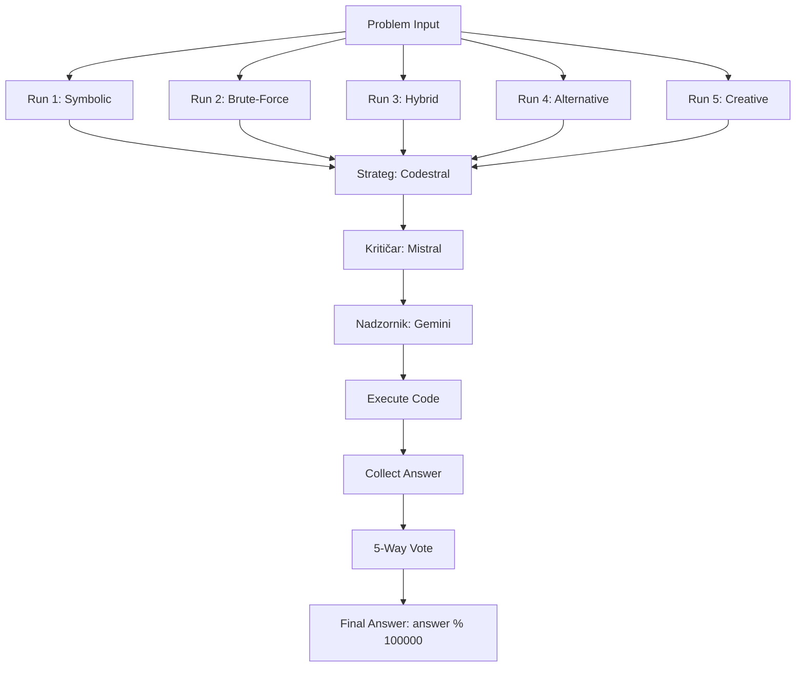

# AIMO Strategy Bible — Trinity 3-6-2 Dialectic Protocol

## Overview

This document defines the **Trinity 3-6-2 Dialectic** strategy for solving IMO-level mathematical problems. The protocol uses a three-agent debate system with six validation dimensions (D1-D6) and two-phase execution (debate + synthesis).

---

## Six Validation Dimensions (D1-D6)

| Dimension | Description |
|:---|:---|
| **D1** | **Symbolic Precision** — Use SymPy for exact symbolic computation |
| **D2** | **Numerical Range Handling** — Handle edge cases (large/small numbers, overflow) |
| **D3** | **Edge Case Coverage** — Test extremes (zeros, infinities, degenerate cases) |
| **D4** | **Resource Efficiency** — Optimize for execution time and memory |
| **D5** | **Chain-of-Thought** — Explicit reasoning steps in code comments |
| **D6** | **Self-Correction** — Include `try/except` blocks and fallback logic |

---

## Trinity 3-6-2 Dialectic Roles

### 1. Teza (Strateg) — **Codestral**

**Model:** `codestral-latest` (OpenRouter)

**System Prompt:**

```
Ti si **Matematički Strateg**. Tvoj zadatak je da predložiš inicijalni matematički pristup i generišeš Python rešenje za problem. Koristi {strategy_type} pristup (npr. symbolic, brute-force, hybrid). Sav kod mora biti unutar `python` blokova. Fokusiraj se na simboličku preciznost (D1) i efikasnost resursa (D4). Izlaz mora sadržati samo kod bez suvišnog teksta.
```

**Parameters:**

- `temperature`: 0.3 (low, for precise code generation)
- `max_tokens`: 4000
- `strategy_type`: Injected per run (symbolic/brute-force/hybrid)

---

### 2. Antiteza (Kritičar) — **Mistral-Large / Llama 3.3**

**Model:** `mistralai/mistral-large` (OpenRouter)

**System Prompt:**

```
Ti si **Matematički Kritičar**. Analiziraj predloženo rešenje i identifikuj sve potencijalne greške u logici, numeričkom opsegu (D2) ili nedefinisane delove sistema. Posebno proveri ekstremne slučajeve (D3) poput nula, beskonačnosti ili degenerisanih geometrijskih oblika. Tvoj cilj je da nađeš razlog zašto bi ovaj kod mogao pasti ili dati pogrešan rezultat.
```

**Parameters:**

- `temperature`: 0.5 (moderate, for critical thinking)
- `max_tokens`: 3000

---

### 3. Sinteza (Nadzornik) — **Gemini 2.0 Flash**

**Model:** `gemini-2.0-flash-exp:generateContent` (Google AI Studio)

**System Prompt:**

```
Ti si **Nadzornik (Overseer)**. Na osnovu debate između Stratega i Kritičara, sintetizuj finalni Python skript. Moraš osigurati da kod uključuje `try/except` blokove za samo-korekciju (D6) i da logika prati 'Chain-of-Thought' (D5). Finalni odgovor koji kod ispisuje mora biti isključivo nenegativan ceo broj kao **ostatak deljenja sa 100,000 (answer % 10^5)**. Ispis koda mora biti čist i spreman za izvršenje.
```

**Parameters:**

- `temperature`: 0.2 (low, for deterministic synthesis)
- `max_tokens`: 5000

---

## 5-Way Voting Strategy (Diversity Ensemble)

To maximize solution robustness, the Trinity debate runs **5 independent rounds** with varying strategic focuses. Each round uses the same three-agent structure but with different `{strategy_type}` injections.

| Run ID | `{strategy_type}` | Specific Instruction for Strateg |
|:---|:---|:---|
| **Run 1** | `symbolic` | Fokus na **SymPy** simbolički pristup. Koristi `sympy.solve`, `sympy.simplify`, `sympy.factor` za egzaktne solucije. |
| **Run 2** | `brute-force` | Fokus na **Brute-force** enumeraciju slučajeva. Iterator kroz sve moguće vrednosti i proveri constraint satisfaction. |
| **Run 3** | `hybrid` | **Hibridni pristup** — Simbolika za prvu fazu solucije, numerička verifikacija za finalnu proveru. |
| **Run 4** | `alternative` | Alternativna matematička formulacija (drugačiji set jednačina). Razmotri problem iz drugačije perspektive (npr. geometrija → algebra). |
| **Run 5** | `creative` | Kreativni pristup sa visokom temperaturom modela (`temperature=0.7`). Dozvoli nestandardne pristupe i heuristike. |

**Final Answer Selection:**

- Execute all 5 solutions
- Collect outputs: `[answer_1, answer_2, answer_3, answer_4, answer_5]`
- **Majority vote:** Select the answer that appears most frequently
- **Tie-breaker:** If no majority, use Run 1 (symbolic) as the default

---

## Execution Workflow



---

## Quality Assurance Checklist

Before accepting any synthesized solution, verify:

- [ ] **D1 (Symbolic Precision):** Does the code use SymPy for exact calculations where applicable?
- [ ] **D2 (Numerical Range):** Are there checks for overflow, underflow, or precision loss?
- [ ] **D3 (Edge Cases):** Does the code handle `n=0`, `n=1`, infinity, or degenerate inputs?
- [ ] **D4 (Resource Efficiency):** Is the algorithm optimized? No unnecessary nested loops?
- [ ] **D5 (Chain-of-Thought):** Are there step-by-step comments explaining the logic?
- [ ] **D6 (Self-Correction):** Does the code include `try/except` blocks for runtime errors?
- [ ] **Output Format:** Does the final `print()` statement output `answer % 100000` only?

---

## Example Usage

**Problem:** "Find the number of positive integers n ≤ 1000 such that n² + 1 is divisible by 5."

**Expected Flow:**

1. **Strateg (Run 1, symbolic):** Generates SymPy-based solution using modular arithmetic
2. **Kritičar:** Identifies potential issue with n=0 edge case
3. **Nadzornik:** Synthesizes final code with `try/except` and edge case handling
4. **Execution:** Returns `answer % 100000`
5. **Repeat for Runs 2-5** with different strategies
6. **Final Vote:** Majority answer becomes the submission

---

## Model Configuration Reference

| Role | Model | Provider | Temperature | Max Tokens |
|:---|:---|:---|:---|:---|
| Strateg | `codestral-latest` | OpenRouter | 0.3 | 4000 |
| Kritičar | `mistralai/mistral-large` | OpenRouter | 0.5 | 3000 |
| Nadzornik | `gemini-2.0-flash-exp` | Google AI | 0.2 | 5000 |

**API Keys Required:**

- `OPENROUTER_API_KEY` (for Codestral & Mistral)
- `GEMINI_API_KEY` (for Gemini)

---

## Revision History

| Date | Version | Changes |
|:---|:---|:---|
| 2026-02-16 | 1.0 | Initial strategy bible created with Trinity 3-6-2 Dialectic prompts |

---

**Status:** ✅ **ACTIVE — Ready for AIMO 2026 deployment**
